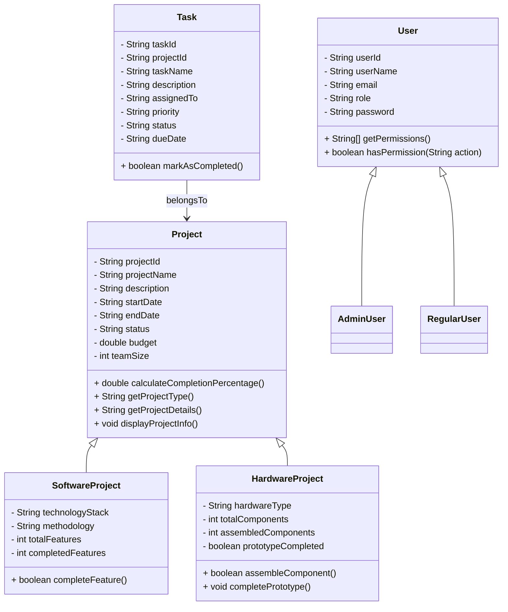

# TaskManagement (Console)

A simple console-based Project & Task Management system implemented in Java.

## Overview

This repository contains a small example application demonstrating OOP principles (encapsulation, inheritance, polymorphism, abstraction) and a menu-driven console UI to manage projects and tasks.

This deliverable includes:
- Cleaned and organized source code under `src/`.
- Services for project/task management and report generation.
- A console UI (`Main.java`, `ConsoleMenu`) for interactive use.

## Requirements

- Java JDK 17+ (project written targeting Java 21 features, but will compile on Java 17+ with minor changes). Ensure `javac` and `java` are on your PATH.
- No external dependencies (in-memory data storage).

## Build & Run (quick)

From project root (where `src/` lives) on Windows PowerShell:

```powershell
# create output folder and compile all .java files
mkdir -Force out; $files = Get-ChildItem -Path src -Recurse -Filter *.java | ForEach-Object { $_.FullName }; javac -d out $files

# run the application
java -cp out Main
```

If your JDK is different or you use an IDE (IntelliJ/VS Code/Eclipse), import the project as a plain Java project and run `Main`.

## Project Structure

- `src/`
  - `Main.java` — application entry point and orchestration
  - `RunReports.java` — small runner to show reports
  - `interfaces/Completable.java` — interface for completion tracking
  - `models/` — domain models (User, AdminUser, RegularUser, Project, SoftwareProject, HardwareProject, Task, StatusReport)
  - `services/` — business logic for projects, tasks, reporting
  - `utils/` — console UI (`ConsoleMenu`) and input validation

## Usage

- Launch the application and follow the console menus.
- Create projects (software/hardware), add tasks, generate reports.
- Sample data is loaded at startup for demonstration.

## Design & Class Diagram

The design uses a small layered architecture:
- Models: Data containers and domain behavior
- Services: Business logic and in-memory persistence
- Utils/UI: Console presentation and input validation

Class diagram (Mermaid):



### OOP Rationale

- Abstraction: `Project` and `User` are abstract or base types capturing common behavior.
- Inheritance: `SoftwareProject` and `HardwareProject` extend `Project` to provide specific fields and completion logic.
- Polymorphism: Services operate on `Project` references and call overridden methods such as `calculateCompletionPercentage()`.
- Encapsulation: Fields are private/protected with getters/setters and controlled mutations.

## Final testing & cleanup notes

What I ran during finalization:
- Static code cleanup and removal of decorative characters and emojis.
- Project-wide compile check (no compile errors reported).
- Basic smoke-run via `Main` to confirm startup, loading of sample data, and menu display.

Manual tests to perform before publishing:
- Create/update/delete projects and tasks via the menu.
- Generate reports and verify counts/percentages.
- Edge cases: duplicate IDs, empty inputs, invalid dates (ValidationUtils validates format).

## Next steps (optional)

- Add a build tool (Maven/Gradle) and unit tests for services.
- Replace fixed-size arrays with `List<>`/Collections for scalability.
- Add persistent storage (file-based or DB) for real-data scenarios.
- Produce an image of the UML class diagram in `docs/` for repo display.

## License

Choose and add an appropriate open-source license if you plan to publish the code.

