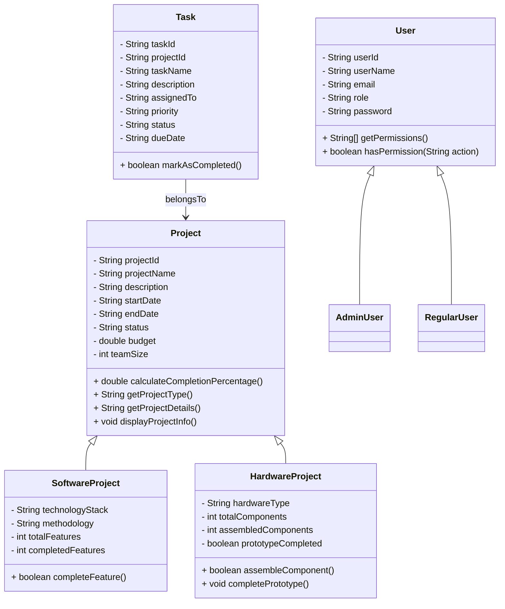

# TaskManagement (Console)

A simple console-based Project & Task Management system implemented in Java.

## Overview

This repository contains a small example application demonstrating OOP principles (encapsulation, inheritance, polymorphism, abstraction) and a menu-driven console UI to manage projects and tasks.

This deliverable includes:
- Cleaned and organized source code under `src/`.
- Services for project/task management and report generation.
- A console UI (`Main.java`, `ConsoleMenu`) for interactive use.

## Requirements

- Java JDK 17+ (project written targeting Java 21 features, but will compile on Java 17+ with minor changes). Ensure `javac` and `java` are on your PATH.
- No external dependencies (in-memory data storage).

## Build & Run (quick)

From project root (where `src/` lives) on Windows PowerShell:

```powershell
# create output folder and compile all .java files
mkdir -Force out; $files = Get-ChildItem -Path src -Recurse -Filter *.java | ForEach-Object { $_.FullName }; javac -d out $files

# run the application
java -cp out Main
```

If your JDK is different or you use an IDE (IntelliJ/VS Code/Eclipse), import the project as a plain Java project and run `Main`.

## Project Structure

- `src/`
  - `Main.java` — application entry point and orchestration
  - `RunReports.java` — small runner to show reports
  - `interfaces/Completable.java` — interface for completion tracking
  - `models/` — domain models (User, AdminUser, RegularUser, Project, SoftwareProject, HardwareProject, Task, StatusReport)
  - `services/` — business logic for projects, tasks, reporting
  - `utils/` — console UI (`ConsoleMenu`) and input validation

## Usage

- Launch the application and follow the console menus.
- Create projects (software/hardware), add tasks, generate reports.
- Sample data is loaded at startup for demonstration.

## Design & Class Diagram

The design uses a small layered architecture:
- Models: Data containers and domain behavior
- Services: Business logic and in-memory persistence
- Utils/UI: Console presentation and input validation

Class diagram (Mermaid):



### OOP Rationale

- Abstraction: `Project` and `User` are abstract or base types capturing common behavior.
- Inheritance: `SoftwareProject` and `HardwareProject` extend `Project` to provide specific fields and completion logic.
- Polymorphism: Services operate on `Project` references and call overridden methods such as `calculateCompletionPercentage()`.
- Encapsulation: Fields are private/protected with getters/setters and controlled mutations.

🔧 Functionality
The TaskManagement console system provides a complete set of project, task, and user-management features powered by Object-Oriented Programming principles. All data is stored in memory and manipulated through a menu-driven console interface.
1. Project Management
•	Create new projects (Software or Hardware)
•	Auto-generated project IDs (format: PJ###)
•	Update existing project details
•	View all projects or filter by type
•	Track project status and completion percentage
•	Display full project summaries

2. Task Management
•	Create tasks linked to a project
•	Auto-generated task IDs (format: TK###)
•	Assign tasks to users
•	Update priority, status, due dates
•	Mark tasks as completed
•	View tasks by project, by user, or all tasks

3. User Management
•	Built-in support for AdminUser and RegularUser
•	Login system using seeded default accounts
•	Controlled permissions:
o	Admins can manage users, projects, tasks, and reports
o	Regular users can view and update only their assigned tasks
•	Switch active user session (Admin ↔ Regular) without restarting the program

4. Reports & Analytics
Includes automated report generation:
•	Project Status Report
•	Task Summary Report
•	Productivity Report (for Regular Users)
•	System-level performance indicators
•	Displays completion percentages using polymorphic logic from Completable interface

5. System Statistics
•	Total projects
•	Total tasks
•	Completed vs Pending tasks
•	User activity summary
•	Auto-refresh of statistics after updates

6. Input Validation & Error Handling
•	Full validation using ValidationUtils:
o	Valid integer inputs
o	Valid dates (YYYY-MM-DD)
o	Valid email formats
o	Enforced menu input range
o	Status & priority validation
•	Prevents invalid data from entering the system

7. Auto-ID Generation
Uses Seed.java to generate:
•	Project IDs → PJ001, PJ002, ...
•	Task IDs → TK001, TK002, ...
•	Ensures uniqueness and prevents manual errors

8. Console User Interface
•	Clean, structured main menu
•	Sub-menus for each management module
•	Fail-safe input handling
•	Reusable UI components via ConsoleMenu


## Final testing & cleanup notes

What I ran during finalization:
- Static code cleanup and removal of decorative characters and emojis.
- Project-wide compile check (no compile errors reported).
- Basic smoke-run via `Main` to confirm startup, loading of sample data, and menu display.

Manual tests to perform before publishing:
- Create/update/delete projects and tasks via the menu.
- Generate reports and verify counts/percentages.
- Edge cases: duplicate IDs, empty inputs, invalid dates (ValidationUtils validates format).

